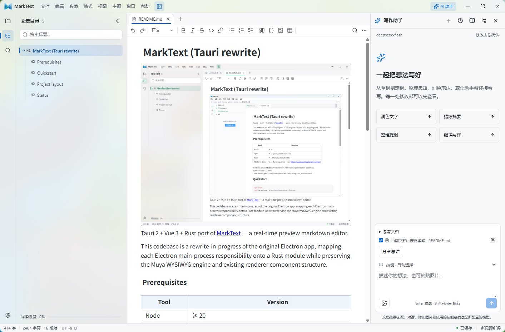
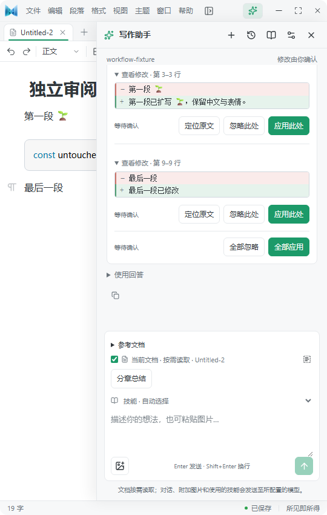
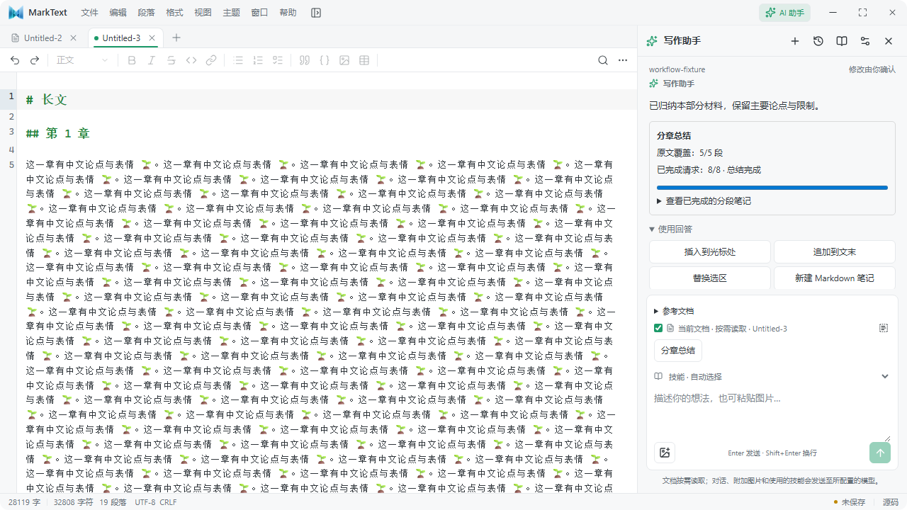
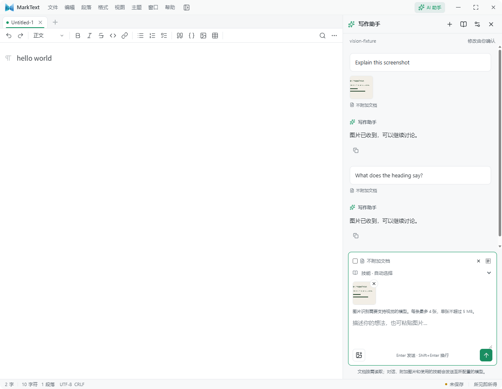
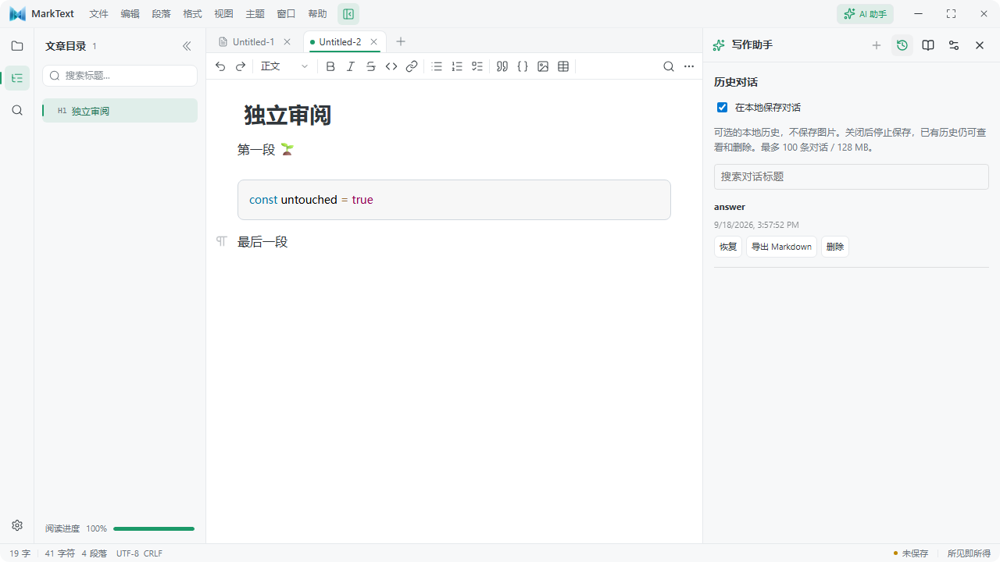
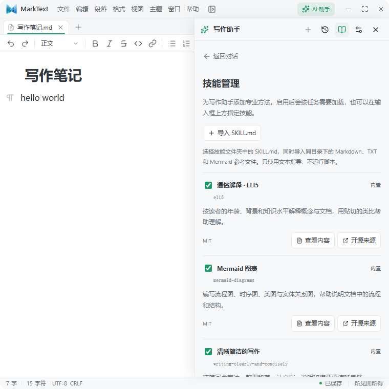

# MarkText

[English](README.md) | [简体中文](README.zh-CN.md)

> A modern, local-first Markdown editor rebuilt with Tauri 2, Vue 3, and Rust — with a writing Agent that helps you think, write, review, and revise without taking control of your document.

[Download the latest release](https://github.com/yulianjie/marktext-rs/releases/latest) · [Writing Agent guide](docs/AI_AGENT.md) · [Release notes](docs/releases/v0.7.0.md)



MarkText keeps the distraction-free, real-time editing experience of the original [MarkText](https://github.com/marktext/marktext), while moving desktop integration, file access, credentials, sync, and AI execution into a Rust backend. It runs on Windows, macOS, and Linux.

## Why MarkText

- **Write, don't preview.** Edit Markdown in a live WYSIWYG surface or switch to source mode when you want the raw text.
- **Use AI without surrendering control.** The Agent can inspect attached snapshots and propose changes, but it cannot silently edit or save your files.
- **Keep local work reliable.** Files are written locally first; optional remote storage has explicit sync, conflict, and offline states.
- **Choose your own model.** Start with DeepSeek, connect an OpenAI-compatible endpoint, or use a local Ollama model.
- **Stay cross-platform.** Native installers are published for Windows x64, Linux x64, and both Apple Silicon and Intel Macs.

## Writing Agent

Open **AI Assistant** from the title bar, the View menu, the command palette, or with `Ctrl/Cmd+Shift+A`. The Agent is built into the editor: there is no separate CLI or Node/Python service to install.

### A review-first writing workflow

1. **Attach only the context you need.** Use the current document, an automatically captured selection, pasted images, or up to eight read-only Markdown references.
2. **Ask naturally.** Polish a paragraph, continue a draft, build an outline, explain a screenshot, compare references, or summarize a long document.
3. **Review every proposed edit.** The Agent shows line-level before/after diffs. Apply, dismiss, locate, or revert changes individually, or handle a reviewed batch together.
4. **Reuse the answer.** Insert at the cursor, append to the document, replace the current selection, or create a new unsaved Markdown note.



### Agent capabilities

| Capability | What it does |
| --- | --- |
| DeepSeek-first model setup | Includes a DeepSeek preset and supports custom OpenAI-compatible endpoints, local Ollama, custom model IDs, and custom request headers. |
| On-demand document reading | Starts with metadata and headings, then searches or reads relevant line ranges. Full-document reads are explicit rather than automatic. |
| Selection-aware editing | Captures selected text from both WYSIWYG and source modes and limits edits to that scope unless you allow full-document reference. |
| Multi-edit review | Proposes up to 32 non-overlapping replacements with per-change and batch apply, dismiss, locate, and revert actions. |
| Snapshot conflict protection | Rejects stale suggestions, citations, and insertion targets after the underlying document has changed. |
| Grounded citations | `cite_document` produces clickable, snapshot-backed source cards that locate the cited passage in the editor. |
| Long-document summaries | Splits long text into bounded sections, shows progress and intermediate notes, and can resume unfinished work when the source is unchanged. |
| Image input | Accepts pasted or selected PNG, JPEG, and WebP images for vision-capable models, including image-only prompts and follow-up questions. |
| Writing skills | Ships with six inspectable skills for clear writing, Markdown documentation, Mermaid diagrams, plain-language explanations, team communication, and co-writing. Import your own text-only `SKILL.md` package when needed. |
| Optional local history | Search, restore, export, and delete locally stored conversations. History is off by default and never stores API keys or images. |

### Long documents, images, history, and skills

| Long-document summary | Image conversations |
| --- | --- |
|  |  |

| Optional local history | Built-in and imported writing skills |
| --- | --- |
|  |  |

### Privacy and safety boundaries

- API keys and custom authentication headers are stored in the operating-system credential store, not in the normal preferences file.
- The Rust backend owns provider requests, streaming, cancellation, request limits, and the tool loop. The webview does not receive reusable secrets.
- The model only gets snapshots that you attach. It has no general filesystem, shell, workspace scan, web search, Git commit, or direct-save tool.
- Reference documents are read-only. Only the current document can receive a reviewed edit proposal.
- Model output is sanitized before rendering. Applying or reverting a suggestion requires matching document identity and content.
- Remote HTTP endpoints are supported for trusted networks, but they send prompts and credentials without transport encryption; prefer HTTPS outside a controlled local network.

See [docs/AI_AGENT.md](docs/AI_AGENT.md) for setup, limits, protocol details, and the complete privacy model. See [docs/AI_AGENT_SKILLS.md](docs/AI_AGENT_SKILLS.md) for bundled skill sources and the import format.

## Editor features

- Real-time WYSIWYG Markdown editing powered by Muya, plus a source-code mode.
- Tabs, project tree, outline, global search, find/replace, file watching, and encoding detection.
- CommonMark/GFM editing, tables, task lists, math, code blocks, images, links, footnotes, and diagrams including Mermaid, Flowchart, Sequence, and PlantUML.
- Focus and typewriter modes, multiple built-in themes, user themes, and automatic light/dark switching.
- Keyboard-first command palette and a unified, customizable shortcut system shared by the native menu and editor.
- Export to styled HTML; print or save as PDF through the system dialog; optional Pandoc export to PDF, DOCX, ODT, and EPUB.
- Local-first project storage with optional private MarkText Sync, Git, WebDAV, and Storage Plugin Protocol providers.
- English, Simplified Chinese, and Japanese application interfaces.

## Local-first storage and sync

MarkText always saves to a local working copy first. Optional project storage keeps local save state separate from remote sync state, so a network failure does not turn a successful local save into a failure.

- **Private MarkText Sync:** a self-hosted Axum/SQLite service with version history, conditional writes, change cursors, and soft-delete tombstones.
- **Git:** validates repositories, fetches, fast-forward pulls, and pushes without force. Divergence and conflicts are explicit; MarkText does not reset, auto-commit, or auto-push.
- **WebDAV:** uses strong ETags for safe conditional changes and refuses unsafe automatic remote writes when reliable version checks are unavailable.
- **Storage plugins:** vendor-neutral JSON-RPC stdio protocol for user-installed, trusted native providers.

For the security model and provider contract, read [docs/STORAGE_PLUGIN_PROTOCOL.md](docs/STORAGE_PLUGIN_PROTOCOL.md) and [docs/CLOUD_STORAGE_DESIGN.md](docs/CLOUD_STORAGE_DESIGN.md).

## Download

Get release artifacts from the [latest GitHub release](https://github.com/yulianjie/marktext-rs/releases/latest):

| Platform | Packages |
| --- | --- |
| Windows x64 | NSIS `.exe`, MSI |
| Linux x64 | AppImage, DEB, RPM |
| macOS Apple Silicon | `.app.tar.gz` |
| macOS Intel | `.app.tar.gz` |

Windows 11 already includes WebView2. Windows 10 may need the WebView2 Runtime. On macOS, the distributed archive may require the usual Gatekeeper approval for an independently distributed application.

## Build from source

### Prerequisites

| Tool | Requirement |
| --- | --- |
| Node.js | 20 or newer |
| npm | 10 or newer |
| Rust | Stable toolchain, 1.77 or newer |
| Platform libraries | [Tauri 2 prerequisites](https://tauri.app/start/prerequisites/) |

Windows needs Visual Studio C++ Build Tools and WebView2. macOS needs Xcode Command Line Tools. Linux needs the Tauri WebKitGTK/AppIndicator development packages for your distribution.

### Development

```bash
npm install
npm run tauri:dev
```

Useful commands:

```bash
npm run dev          # Vite frontend only
npm run build        # Type-check and production frontend build
npm run lint         # ESLint
npm run test:unit    # Vitest
npm run test:e2e     # Playwright
npm run tauri:build  # Native production bundles
```

Native bundles are written under `src-tauri/target/release/bundle/`.

## Architecture

```text
Vue 3 + Pinia + Muya webview
  ├─ editor state, panels, sessions, and reviewed interactions
  └─ typed Tauri invoke/event bridge
                 │
Rust / Tauri 2 backend
  ├─ filesystem, watcher, search, preferences, native menus
  ├─ Agent network transport, credentials, tools, and history
  └─ local-first storage, sync, Git, WebDAV, and plugins
```

Renderer-to-Rust calls use typed wrappers in `src/services/tauri-invoke.ts`; Rust-to-renderer events are registered in `src/services/tauri-bridge.ts`. The migration map is documented in [docs/IPC_MAP.md](docs/IPC_MAP.md).

## Project status

This repository is an active Tauri rewrite of the original Electron MarkText. The core editor, desktop workflows, writing Agent, export paths, and local-first storage are implemented, while exact feature parity and platform polish continue to evolve. Check the [release notes](docs/releases/) and [latest release](https://github.com/yulianjie/marktext-rs/releases/latest) for the current verified scope.

## Credits and license

MarkText builds on the original [MarkText](https://github.com/marktext/marktext) project and its Muya editor engine. This repository is released under the [MIT License](LICENSE).
